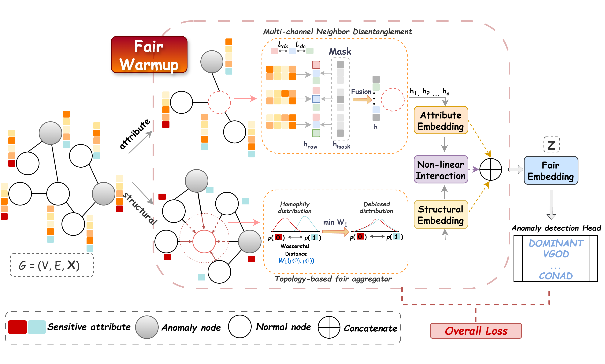

# MDFairAD: Fair Graph Anomaly Detection via Multi-Disentangled Representation Processing

This repository provides the official implementation of **MDFairAD**, a fair graph anomaly detection (GAD) framework built around the **Multi-Disentangled Fair Processor (MDFP)** — an upstream representation module that can be plugged in front of off-the-shelf anomaly detection heads (DOMINANT, CONAD, VGOD, CoLA).

<p align="center">
  
</p>

The figure above gives the overall framework of MDFairAD. The input attributed graph is processed by three parallel branches inside the **Multi-Disentangled Fair Processor (MDFP)** — an attribute branch on a sensitive-free KNN graph, a structural branch on the original adjacency under a Wasserstein subgroup alignment, and a nonlinear interaction branch that fuses the two debiased views. The three branch embeddings are concatenated into a fair fused representation $\mathbf{Z}=[\mathbf{Z}_S \,\|\, \mathbf{Z}_A \,\|\, \mathbf{Z}_I]$, which is forwarded to a downstream GAD head and trained end-to-end with branch-level fairness losses. After warmup, MDFP can be reused as a standalone fair processor or jointly fine-tuned with any anomaly head.

## Overview

MDFairAD addresses two parallel sensitive-information leakage routes in graph anomaly detection — **node attributes** and **graph topology** — under a unified Structural Causal Model. It consists of two stages:

- **MDFP (warmup)** — a three-branch fair processor (attribute / structural / nonlinear-interaction branches) that produces a debiased fused representation $\mathbf{Z}=[\mathbf{Z}_S \,\|\, \mathbf{Z}_A \,\|\, \mathbf{Z}_I]$. After warmup, MDFP can be **reused as a standalone fair representation processor** (e.g., for fair node classification benchmarks).
- **MDFP + GAD head (joint training)** — the warmed MDFP is fine-tuned together with an anomaly detection head (DOMINANT / CONAD / VGOD / CoLA), so the head receives a fair representation rather than the raw graph.

This separation makes fairness control reusable across heterogeneous detectors and decouples it from any single detector's design.

## Environment

- Python 3.10
- CUDA 12.1
- PyTorch 2.1
- Recommended hardware: NVIDIA GPU with >= 12 GB VRAM (Reddit / Twitter need batch + neighbor sampling)

Required Python packages:

```
torch==2.1.0
torch_geometric
torch_scatter==2.1.2    
torch_sparse==0.6.18     
torch_cluster==1.6.2   
torch_spline_conv==1.2.2
pygod                    
numpy
scipy
scikit-learn
pyyaml
wandb
```

Install (Linux example):

```bash
conda create -n mdfairad python=3.10 -y
conda activate mdfairad

pip install torch==2.1.0 --index-url https://download.pytorch.org/whl/cu121
pip install torch_geometric

pip install ./torch_scatter-2.1.2+pt21cu121-cp310-cp310-linux_x86_64.whl
pip install ./torch_sparse-0.6.18+pt21cu121-cp310-cp310-linux_x86_64.whl
pip install ./torch_cluster-1.6.2+pt21cu121-cp310-cp310-linux_x86_64.whl
pip install ./torch_spline_conv-1.2.2+pt21cu121-cp310-cp310-linux_x86_64.whl

pip install pygod numpy scipy scikit-learn pyyaml wandb
```

## Implementation

Two main entry points cover the two usage modes:

- **`basic_model.py`** — runs MDFP **standalone** (the three-branch fair representation processor), no anomaly-detection head. Used for fair-representation analysis and as the warmed-up upstream module.
- **`run_fair_ad.py`** — runs the full **MDFP + GAD head** pipeline: MDFP three-branch warmup followed by joint fine-tuning with an anomaly head. The head is selected by `--MDFairAD {dominant, conad, vgod, cola}`.

## Example Runs

### 1) MDFP + GAD head (fair anomaly detection)

Run the full **MDFP + joint anomaly head** path:

```bash
# Reddit, MDFP + DOMINANT
python run_fair_ad.py --dataset reddit --MDFairAD dominant

# Reddit, MDFP + CONAD
python run_fair_ad.py --dataset reddit --MDFairAD conad

# Credit, MDFP + DOMINANT
python run_fair_ad.py --dataset credit --MDFairAD dominant

# Credit, MDFP + CONAD
python run_fair_ad.py --dataset credit --MDFairAD conad
```

These runs report AUC-ROC, AUC-PR, and the fairness gaps $\Delta_{DP}$ / $\Delta_{EO}$.

#### Warmup cache (optional, recommended for repeated runs)

The MDFP warmup stage (training the three branches before the anomaly head) is the most time-consuming part of `run_fair_ad.py`. To avoid repeating it on every run, the trained branch states can be cached on disk and reloaded:

```bash
# First run: warm up MDFP and save the cache to saved_models/e2e_warmup_cache/<dataset>_warmup.pt
python run_fair_ad.py --dataset reddit --MDFairAD dominant --e2e_cache_warmup

# Subsequent runs: skip the warmup stage and load the cached MDFP state directly
python run_fair_ad.py --dataset reddit --MDFairAD dominant --e2e_load_warmup
```

- `--e2e_cache_warmup` writes the structural / attribute / non-linear branch state dicts to `saved_models/e2e_warmup_cache/{dataset}_warmup.pt` after warmup completes.
- `--e2e_load_warmup` loads that cache at startup and jumps directly to the joint fine-tuning stage with the anomaly head; you can switch the `--MDFairAD` between cached runs without re-warming MDFP.

### 2) MDFP only (no anomaly head, fair processor warmup)

To use MDFP **standalone** as a fair representation processor — i.e., train the three-branch fair processor without any anomaly-detection head — run **`basic_model.py`** with `--model MDFP`:

```bash
# Reddit, MDFP-only
python basic_model.py --dataset bail --model MDFP

# Credit, MDFP-only
python basic_model.py --dataset credit --model MDFP
```

`basic_model.py` exposes only the MDFP three-branch model and reports fair-representation metrics (AUC-ROC / $\Delta_{DP}$ / $\Delta_{EO}$) without coupling to any GAD head.

### Why two modes?

These two modes correspond directly to the two roles of MDFP described in the paper:

- **MDFP + GAD head** is the standard MDFairAD pipeline: the warmed MDFP is **jointly fine-tuned** with a downstream anomaly detector, so the head sees a debiased fused representation rather than raw, sensitive-correlated inputs.
- **MDFP only** treats the warmed MDFP as a **reusable upstream fair representation processor**, decoupled from any specific scorer. In this form MDFP can be plugged into other downstream tasks (e.g., fair node classification) with the same fair representation, demonstrating that the fairness module is detector-agnostic.

## Reproducing Paper Tables

Per-dataset hyperparameters live in `configs/*.yml`. Multi-seed evaluation is controlled by `--seed_num` (default 5).

```bash
python run_fair_ad.py --dataset reddit --MDFairAD dominant --seed_num 5
```

